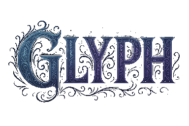

# ✨ GLYPH ✨



## Transform Your Text Into Magical Glyphs

Glyph is a web-based tool that converts standard Latin characters to visually similar Unicode characters (primarily Cyrillic), creating text that looks nearly identical to the original but uses different character codes.


## ✨ Features

- **Character Transformation**: Convert Latin characters to visually similar Unicode characters
- **Animated Interface**: Engaging visual effects and transitions
- **Real-time Character Count**: Keep track of your input length with real-time counter
- **Copy to Clipboard**: Easily copy transformed text
- **Mobile Responsive**: Works on all device sizes
- **Detailed Statistics**: View exactly how many characters were transformed


## 🛠️ How It Works

Glyph uses a carefully curated mapping of Latin characters to their nearly identical homoglyphs, primarily using Cyrillic characters. The transformed text:

- Looks virtually identical to the original
- Uses different Unicode code points
- Works in USC-2 and SMS communications
- Maintains readability while using alternative character sets

## 🧰 Tech Stack

- HTML5, CSS3, JavaScript (ES6+)
- PHP (minimal server-side functionality - will eventually serve an endpoint)
- Particles.js for background effects
- Font Awesome for icons
- Toastify.js for notifications
- CSS Animations for visual effects

## 📋 Project Structure

```
glyph/
├── assets/                 # Static assets (images, icons)
├── css/                    # Stylesheets
│   ├── animations.css      # Animation-specific styles
│   └── main.css            # Main stylesheet
├── js/                     # JavaScript files
│   ├── animations.js       # Visual effects and animations
│   ├── homoglyphs.js       # Character conversion functionality
│   └── main.js             # Main application logic
├── index.php               # Main entry point
└── manifest.json           # PWA manifest file
```

## 🚀 Installation

1. Clone this repository:
   ```bash
   git clone https://github.com/saintpetejackboy/glyph.git
   ```

2. Place the files on a web server with PHP support
   
3. Access the tool via your web browser

## 🔍 Character Mapping

The tool uses a comprehensive mapping of characters, including:

- Latin to Cyrillic lookalikes (a → а, e → е, etc.)
- Preserving characters that don't have good homoglyphs
- Maintaining all punctuation and special characters

## 🧩 Core Functions

- `convertToHomoglyphs(text)`: Converts input text to homoglyphs
- `analyzeChanges(original, converted)`: Reports on which characters were changed
- `getUnicodeInfo(char)`: Provides Unicode information for characters
- `isValidForUSC2(char)`: Validates characters for USC-2 compatibility

## 🎨 User Interface

Glyph features a magical, mystical interface with:

- Particle background effects
- Animated button interactions
- Character reveal animations
- Magical transformation effects
- Custom loading animations
- Toast notifications

## 📱 Mobile Support

The interface is fully responsive and works on:
- Desktops
- Laptops
- Tablets
- Mobile phones

## 🤝 Contributing

Contributions are welcome! Feel free to:

1. Fork the repository
2. Create your feature branch: `git checkout -b feature/amazing-feature`
3. Commit your changes: `git commit -m 'Add some amazing feature'`
4. Push to the branch: `git push origin feature/amazing-feature`
5. Open a Pull Request

## 📜 License

This project is licensed under the MIT License - see the LICENSE file for details.

## 🔮 Future Plans

- Develop API for programmatic access

## 👨‍💻 Author

**SaintPeteJackBoy** - [GitHub](https://github.com/saintpetejackboy)

